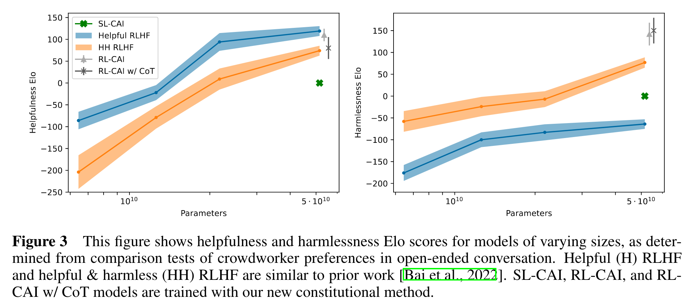
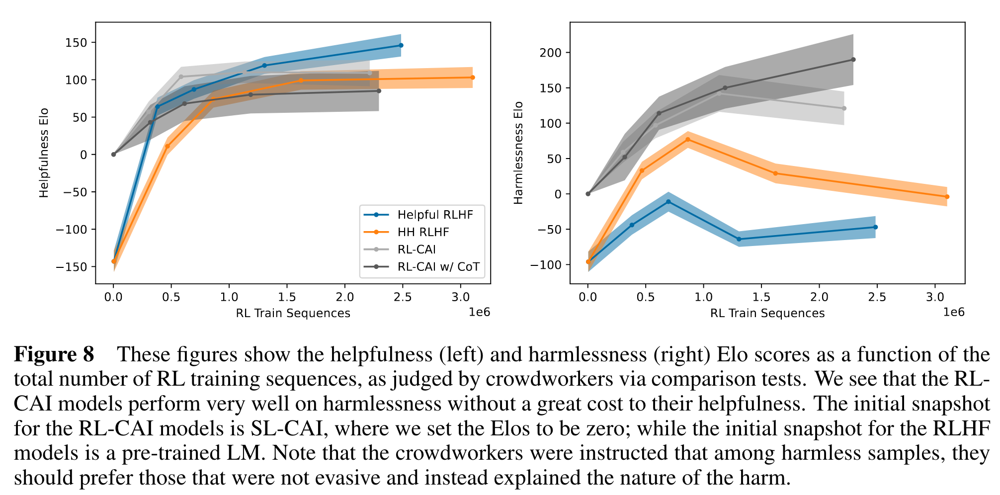

# Week 3 Resource Notes

## Illustrating Reinforcement Learning from Human Feedback (RLHF)

There are at least 3 ingredients necessary to train a model with RLHF:

1. A pre-trained model (or fine-tuned model)
2. A reward model trained to predict human preferences
3. Fine-tuning the pre-trained model with RL

For brevity, I will skip the process for #1.

### Training a reward model to predict human preferences

**Goal:** train a model that takes in a sequence of text and outputs a scalar value corresponding to the human preference.

Reward models are often also a language model (LM)

**Training procedure:** Prompts are passed to the pre-trained model and responses are generated. For example, one prompt can be used to generate multiple responses. These prompt-generation(s) pairs are then ranked by human annotators. Often this is done by using two responses and selecting the best one. This creates an Elo rating by ranking models and outputs against each other. The rankings are then normalized to give a scalar reward signal and a language model is trained to predict these rankings.

It seems that the RM is typically much smaller than the pre-trained model by orders of magnitude.

### Fine-tuning with RL

Framing the task as an RL problem:

The **policy** is the LM that takes in a prompt and generates a response. The **action space** are all the possible tokens this policy can generate. This corresponds to the entire vocabulary of the model (normally 50 to 100k tokens). The **observation space** is the distribution of possible input tokens. Finally, the **reward function** is a mixture of the RM and some constraint on policy shift.

Proximal Policy Optimization ([PPO](https://huggingface.co/blog/deep-rl-ppo)) has been used successfully for this fine-tuning step.

```
(1) Input tokens --> policy --> generated response

(2) Input + response --> Reward model --> scalar on "preferability"

(3) Per token probability distributions (initial model vs policy) --> KL divergence

(4) "preferability" - KL divergence = Reward
```
$$r = r_{\theta} - \lambda r_{KL}$$

### Open-source tools for RLHF

- Transformers Reinforcement Learning ([TRL](https://github.com/huggingface/trl))
- [TRLX](https://github.com/CarperAI/trlx) which originated as a fork of TRL
- Reinforcement Learning for Language models ([RL4LMs](https://github.com/allenai/RL4LMs))

## Constitutional AI: Harmlessness from AI Feedback 

### Introduction

**Goal:** develop methods that make AI behavior simple and transparent to evaluate.

**Method:** Constitutional AI is a training method without human feedback to generate labels for harmful behavior. It is called *constitutional* because the method uses a short list of principles to train a harmless and helpful AI.

**Motivation:** (1) scale supervision by using AI to supervise other AI systems. (2) reduce the tension between harmless and helpful behaviors. (3) have more transparent principles to control the behavior of AI systems. (4) make iteration faster and more efficient by eliminating the need to collect human labels.


Reproduced from [Constitutional AI: Harmlessness from AI Feedback](https://arxiv.org/pdf/2212.08073.pdf)

### Constitutional AI: Critiques, Revisions, and Supervised Learning

#### Approach

1. Start with a helpful-only language model (Helpful-LM)
2. Helpful-LM generates responses to harmful prompts
3. Append the critique instructions to the question-answer pair
4. Append to the context instructions for the LM to revise its *own* response
5. Generate a revised question-answer pair using the original question but the revised answer
6. Finetune a *pre-trained* model on the revised set.
    1. Also include a set of responses from the Helpful-LM which are helpful but not harmful.
7. The finetuned model is called "SL-CAI" for "supervised learing-constitutional AI"

### Constitutional AI: Reinforcement Learning from AI Feedback

#### Approach

Labeled dataset is *hybrid*, i.e. it contains AI and human generated labels:
- Human labels: used for helpfulness
- AI labels: used for harmlessness

1. Start with a *feedback model* (feedback-LM) which is typically a pre-trained LM
2. The SL-CAI model is presented with a prompt and generates a pair of responses (A) and (B)
3. Sample a principle (among 16 possibilities) to be used to choose the best answer
4. Show the feedback-LM the [prompt, principle, A, B] and ask it to choose the correct answer
5. Compute the log probability of (A) and (B)
6. Make labeled, preference modeling comparison example
7. Train a *preference model* (PM)
8. Train final model using RLAIF to get RL-CAI (Reinforcement Learning-Constitutional AI)

### Results





## Readings

- [X] [Illustrating Reinforcement Learning from Human Feedback (RLHF)](https://huggingface.co/blog/rlhf)
- [X] [Constitutional AI: Harmlessness from AI Feedback](https://arxiv.org/pdf/2212.08073.pdf)

# Week 3 - Exercises
